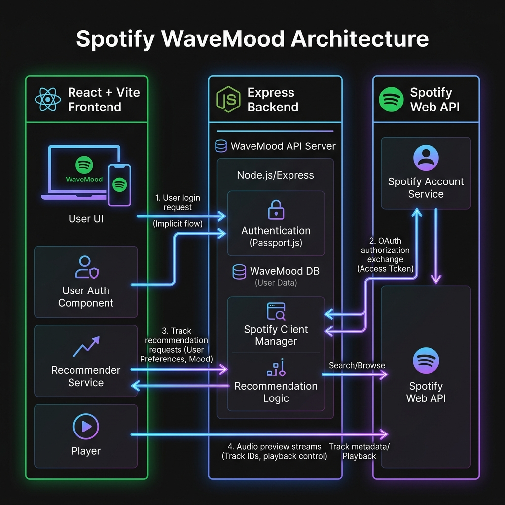

# 🎵 Spotify WaveMood

> An AI-powered, mood-based Spotify music recommendation platform that adapts to your feelings and curates the perfect soundtrack for your day. Fully accessible across all network devices (mobiles, tablets, laptops).

---

## 🚀 Live Product Link

Access the live application from **any device (phone, tablet, laptop)** in the world:

🔗 **[Spotify WaveMood Public Tunnel](https://913264640c53d549-106-219-121-13.serveousercontent.com)**

*(Note: When launching the link for the first time, click the **Continue to Site** button to bypass the browser warning page and access the application dashboard.)*

---

## 🔌 System Integration & Architecture

The diagram below shows the flow of authentication, requests, and data between the frontend, backend, and the external Spotify API:



---

## ✨ Features

- **🎭 Mood-Based Curation**: Dynamically generates track recommendations tailored to specific moods (e.g., Happy, Energetic, Sad, Chill, Focus, Workout).
- **🔒 Spotify Integration**: Seamless OAuth authentication flow to securely authorize your Spotify account and display real profile details.
- **🎨 Premium UI/UX**: Stunning Spotify-inspired dark mode user interface featuring smooth glassmorphism effects, loading skeleton states, responsive sidebars, and micro-animations.
- **🎧 Audio Preview Player**: Listen to high-quality audio previews of recommended tracks directly from the app interface.
- **💾 Recent Mood History**: Tracks and persists your recently selected moods across sessions using Zustand middleware.
- **📅 Custom Playlist Export**: Instantly export recommended tracks directly into a new playlist on your Spotify account.
- **📱 Cross-Device Accessibility**: Bound to all network interfaces with an HTTPS tunnel for testing on mobile Safari, Chrome, and tablets.

---

## 🛠️ Technology Stack

### Frontend
- **Framework**: React (Vite-powered)
- **Styling**: Tailwind CSS & Glassmorphism design tokens
- **Animations**: Framer Motion
- **State Management**: Zustand (with local storage persistence)
- **Icons**: Lucide React
- **API Client**: Axios

### Backend
- **Framework**: Node.js & Express
- **API Integration**: Spotify Web API
- **Session Management**: express-session (secure cookie management)

---

## 💻 Local Setup & Development

### 1. Prerequisites
Ensure you have **Node.js (v18+)** installed.

### 2. Spotify Developer Credentials
1. Go to the [Spotify Developer Dashboard](https://developer.spotify.com/dashboard).
2. Create an App and configure the Redirect URI as `http://localhost:3001/api/auth/callback`.
3. Note your **Client ID** and **Client Secret**.

### 3. Backend Setup
1. Navigate to the backend directory:
   ```bash
   cd spotify-mood-app/backend
   ```
2. Install dependencies:
   ```bash
   npm install
   ```
3. Create a `.env` file based on `.env.example`:
   ```env
   PORT=3001
   CLIENT_ID=your_spotify_client_id
   CLIENT_SECRET=your_spotify_client_secret
   REDIRECT_URI=http://localhost:3001/api/auth/callback
   SESSION_SECRET=a_secure_session_secret_key
   FRONTEND_URL=http://localhost:5173
   ```
4. Start the server:
   ```bash
   npm run dev
   ```

### 4. Frontend Setup (Phase 7)
1. Navigate to the phase-7 directory:
   ```bash
   cd phase-7
   ```
2. Install dependencies:
   ```bash
   npm install
   ```
3. Run the development server:
   ```bash
   npm run dev
   ```
4. Build the optimized production bundle:
   ```bash
   npm run build
   ```
5. Run the production preview server:
   ```bash
   npm run preview -- --host 0.0.0.0 --port 5173
   ```

### 5. Exposing to Local Network/Mobile
To test the production build on your mobile device, expose the local preview port using a Serveo secure HTTPS tunnel:
```bash
ssh -o StrictHostKeyChecking=no -R 80:127.0.0.1:5173 serveo.net
```
Use the generated HTTPS URL on any mobile device on your network!
