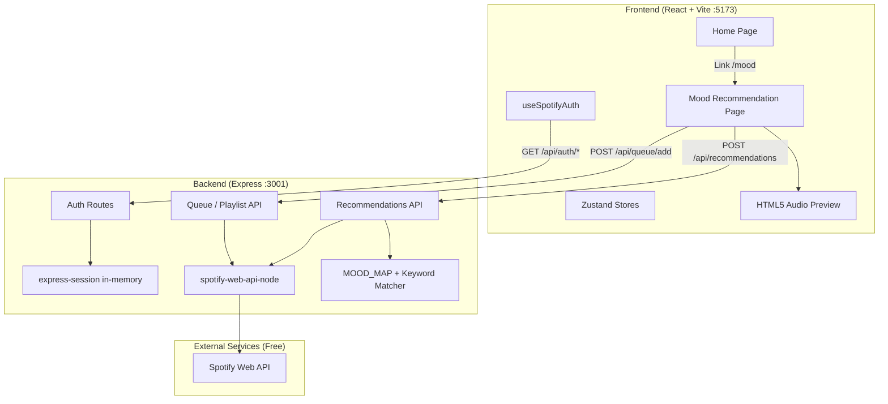
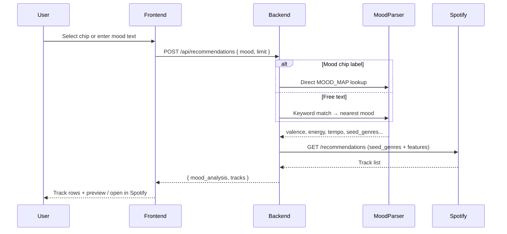
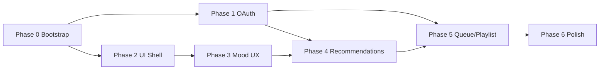

# Spotify Mood-Based Recommendation App — Architecture & Roadmap

> **Free-only policy:** This project uses exclusively free and open-source tools. No paid APIs, no premium-only Spotify features, and no paid hosting required for local development or demo deployment.

---

## 1. Vision

A full-stack web app that feels like Spotify's UI and recommends tracks from a user's mood (chips or free text). Users land on a Spotify-style home page, open the Mood Finder, and get curated tracks they can save as a playlist or open in Spotify.

**Playback approach (free):** Use Spotify's 30-second `preview_url` clips via the HTML5 `<audio>` element, and link each track to `open.spotify.com`. Do **not** use the Spotify Web Playback SDK (requires Spotify Premium).

**Mood mapping approach (free):** Use a hardcoded `MOOD_MAP` for mood chips and a local keyword-matching service for free-text input. Do **not** use OpenAI or any other paid AI API.

---

## 2. Free Stack Summary

| Layer | Tool | Cost |
|-------|------|------|
| Frontend | React, Vite, Tailwind CSS, React Router, Axios, Zustand, Lucide React | Free (open source) |
| Backend | Node.js, Express, `spotify-web-api-node`, `dotenv`, `cors` | Free (open source) |
| Sessions | `express-session` (in-memory) | Free |
| Auth & music data | Spotify Web API + free Spotify Developer account | Free (rate limits apply) |
| Mood → features | `MOOD_MAP` + local keyword matcher | Free |
| Audio previews | Spotify `preview_url` + HTML5 audio | Free |
| Font | `'Helvetica Neue', Helvetica, Arial, sans-serif` | Free (no Spotify Circular font) |
| Local dev | `localhost` | Free |
| Optional deploy | Vercel (frontend) + Render free tier (backend) | Free tier |

**Not used (paid or premium-only):**

- OpenAI / any paid LLM API
- Redis / paid session stores (in-memory is sufficient)
- Spotify Web Playback SDK (Premium required)
- Spotify Premium subscription (not required for this app)

**User account requirement:** A free Spotify account is enough for login, recommendations, playlist creation, and queue add (when Spotify is open on a device).

---

## 3. System Architecture



### Data Flow: Mood → Tracks



---

## 4. Project Structure

```
spotify-mood-app/
├── frontend/                 # React + Vite
│   ├── src/
│   │   ├── components/       # Sidebar, TopBar, MoodChip, TrackRow, etc.
│   │   ├── pages/            # Home, MoodRecommendation, Login
│   │   ├── hooks/            # useSpotifyAuth, useRecommendations
│   │   ├── store/            # authStore, moodStore
│   │   └── index.css         # Spotify design tokens
│   ├── .env
│   └── package.json
├── backend/
│   ├── src/
│   │   ├── server.js         # Express entry
│   │   ├── auth.js           # OAuth helpers
│   │   ├── routes/           # auth, recommendations, queue, playlist
│   │   ├── services/
│   │   │   ├── moodMap.js    # Hardcoded mood → audio features
│   │   │   ├── moodParser.js # Chip lookup + free-text keyword matching
│   │   │   └── spotify.js    # Spotify API wrapper
│   │   └── middleware/       # auth check, error handler
│   ├── .env
│   └── package.json
├── architecture.md           # This document
├── README.md
└── .env.example
```

---

## 5. Design System Reference

| Token | Value | Usage |
|-------|-------|-------|
| `--spotify-black` | `#121212` | Page background |
| `--spotify-dark` | `#181818` | Secondary surfaces |
| `--spotify-card` | `#282828` | Cards, inputs |
| `--spotify-hover` | `#3E3E3E` | Hover states |
| `--spotify-green` | `#1DB954` | CTAs, accents |
| Sidebar | `#000000` | Left nav |
| Top nav | `rgba(0,0,0,0.8)` + blur | Header |

Typography: `'Helvetica Neue', Helvetica, Arial, sans-serif` (free system stack — do not bundle Spotify's proprietary Circular font).

---

## 6. API Contract Summary

| Method | Endpoint | Purpose |
|--------|----------|---------|
| GET | `/api/auth/login` | Redirect to Spotify OAuth |
| GET | `/api/auth/callback` | Exchange code, store tokens, redirect to `/mood` |
| GET | `/api/auth/me` | Return logged-in user profile |
| POST | `/api/recommendations` | Mood → MOOD_MAP/keyword match → Spotify recommendations |
| POST | `/api/queue/add` | Add track URI to playback queue |
| POST | `/api/playlist/create` | Create private playlist with track URIs |

**Security:** All Spotify calls go through the backend; `client_secret` never reaches the frontend.

**Removed (not free):** `GET /api/auth/token` for Web Playback SDK — not needed without Premium playback.

---

## 7. Free Mood Parsing

### Mood chips

Direct lookup in `MOOD_MAP` by chip label (e.g. `"Chill"` → audio features).

### Free-text input

Local keyword matcher — no external API. Match user text against keyword lists per mood, score each mood, pick the highest match. Fall back to `"Chill"` if no keywords match.

Example keyword groups:

| Mood | Sample keywords |
|------|-----------------|
| Sleepy | tired, sleepy, exhausted, bedtime, drowsy |
| Motivated | motivated, workout, gym, energy, pump |
| Emotional | emotional, heartbreak, feelings, vulnerable |
| Happy | happy, joyful, upbeat, sunshine, great |
| Chill | chill, calm, relaxed, peaceful, mellow |
| Party | party, dance, club, celebration, hype |
| Angry | angry, rage, furious, intense, mad |
| Focus | focus, study, concentrate, work, productive |
| Sad | sad, lonely, depressed, melancholy, crying |

```javascript
// moodParser.js — free, runs entirely on the backend
function parseMood(text) {
  if (MOOD_MAP[text]) return { features: MOOD_MAP[text], detected: text };

  const scores = scoreKeywords(text.toLowerCase(), MOOD_KEYWORDS);
  const detected = topMatch(scores) ?? 'Chill';
  return { features: MOOD_MAP[detected], detected };
}
```

---

## 8. Phase-Wise Roadmap

### Phase 0 — Project Bootstrap (Days 1–2)

**Goal:** Runnable layout with free dev tooling only.

| Task | Deliverable |
|------|-------------|
| Scaffold `frontend` with Vite + React | `npm run dev` on `:5173` |
| Scaffold `backend` with Express | `npm run dev` on `:3001` |
| Configure Tailwind with Spotify tokens | CSS variables in `index.css` |
| Add React Router, Axios, Zustand, Lucide | All free OSS dependencies |
| CORS, dotenv, basic health route | `GET /api/health` returns OK |
| `.env.example` + README setup section | Spotify Dashboard instructions |

**Exit criteria:** Both apps start locally at zero cost; frontend hits backend health endpoint.

---

### Phase 1 — Spotify OAuth (Days 3–5)

**Goal:** Users log in with a free Spotify account and stay authenticated.

| Task | Deliverable |
|------|-------------|
| Free Spotify Developer app + redirect URI | `http://localhost:3001/api/auth/callback` |
| `auth.js`: scopes, authorize URL, token exchange | Authorization Code Flow |
| `express-session` in-memory store | Tokens stored server-side (no Redis) |
| Routes: `/login`, `/callback`, `/me` | Full OAuth cycle |
| Token refresh middleware | Auto-refresh on 401 via `refreshAccessToken()` |
| Frontend: `Login.jsx`, `useSpotifyAuth`, `authStore` | Login CTA + auth state |
| Protected route guard on `/mood` | Redirect if unauthenticated |

**Exit criteria:** Login → redirect to `/mood` → session persists across refresh.

---

### Phase 2 — Spotify UI Shell (Days 6–9)

**Goal:** Layout that matches Spotify using only free CSS and components.

| Task | Deliverable |
|------|-------------|
| `Sidebar.jsx` | Library, playlists, nav links |
| `TopBar.jsx` | Search bar, user avatar |
| `Home.jsx` | Good evening, featured rows (mock static data) |
| `MoodBanner.jsx` | Gradient banner, dismissible via `localStorage` |
| Shared layout wrapper | Sidebar + TopBar on all pages |
| Responsive: sidebar → bottom tab bar `< 768px` | Mobile layout |
| `PreviewPlayer.jsx` | Bottom bar for 30s HTML5 preview playback |

**Exit criteria:** Home looks like Spotify; banner links to `/mood`; dismiss persists.

---

### Phase 3 — Mood Input UX (Days 10–12)

**Goal:** Mood page UI complete without live recommendations.

| Task | Deliverable |
|------|-------------|
| `MoodRecommendation.jsx` page shell | Full layout with sidebar |
| `MoodChip.jsx` + `MoodChipGrid.jsx` | 9 chips with colors, selection ring |
| `MoodInput.jsx` | Textarea, 280 char limit, counter |
| Chip click → pre-fill + submit hook | Wired to store |
| Typing animation on chip select | Smooth text fill |
| Mood history (last 3) in `localStorage` | Quick-access chips |
| `moodStore.js` | Selected mood, input, history |
| Micro-interactions | Chip `scale(1.05)`, spring animation |

**Exit criteria:** All mood UX works; submissions log to console or mock API.

---

### Phase 4 — Recommendation Engine (Days 13–16)

**Goal:** End-to-end mood → track list using free parsing only.

| Task | Deliverable |
|------|-------------|
| `moodMap.js` | Hardcoded chip → audio features |
| `moodParser.js` | Chip lookup + free-text keyword matching |
| Spotify `/recommendations` integration | Always include `seed_genres` |
| `POST /api/recommendations` | `{ mood_analysis, tracks }` |
| `useRecommendations.js` hook | Loading, error, refresh |
| `LoadingPulse.jsx` | Skeleton loaders |
| Error toast (bottom-right, 4s auto-dismiss) | User-friendly failure messages |
| Empty state copy | "Try a mood chip or different words" |
| Refresh button | Re-run same mood query for variety |

**Exit criteria:** Chip or text mood returns up to 20 tracks with metadata. No paid API calls.

---

### Phase 5 — Results & Spotify Actions (Days 17–19)

**Goal:** Users act on recommendations using free Spotify features.

| Task | Deliverable |
|------|-------------|
| `TrackRow.jsx` | 40px art, title, artist, album, duration |
| `TrackList.jsx` | Staggered slide-in (50ms delay) |
| Hover: `#282828`, green play/preview button | Row interactions |
| 30s preview via `preview_url` + HTML5 audio | Free in-browser listening |
| "Open in Spotify" link per track | `https://open.spotify.com/track/{id}` |
| `POST /api/queue/add` | `PUT /me/player/queue` (free account; device must be active) |
| `POST /api/playlist/create` | Private playlist + add tracks (free account) |
| "Save as Playlist" footer action | Name + bulk URIs |

**Exit criteria:** Previews play where available; playlist creation works; queue add works when Spotify is open on a device.

---

### Phase 6 — Polish, Edge Cases & Docs (Days 20–22)

**Goal:** Robust local dev experience at zero cost.

| Task | Deliverable |
|------|-------------|
| Token expiry + refresh edge cases | Graceful re-login |
| Tracks without `preview_url` | Show "Open in Spotify" instead of play button |
| Rate limit / Spotify error handling | Meaningful error messages |
| Verify Recommendations API access on dev app | Document workaround if restricted |
| README: Dashboard setup, env vars, run commands | Onboarding doc |
| Manual test checklist | Auth, mood, preview, queue, playlist, mobile |

**Exit criteria:** README lets a new dev run the app locally in under 15 minutes with no paid accounts.

---

### Phase 7 — Optional Free Enhancements (Future)

| Feature | Notes |
|---------|--------|
| Real home data | User's top artists, recently played from free Spotify API |
| Share playlist link | Return `open.spotify.com/playlist/...` after create |
| Mood history sync | Persist last moods in `localStorage` only (no database) |
| Free deploy | Vercel (frontend) + Render free tier (backend) |
| E2E tests | Playwright (free, open source) |

**Explicitly excluded (not free):**

- OpenAI or any paid LLM
- Spotify Web Playback SDK (Premium)
- Redis, PostgreSQL, or any paid database for sessions
- Paid hosting tiers

---

## 9. Dependency Graph (Phases)



Phases 1 and 2 can run in parallel after Phase 0. Phase 4 needs Phase 1 (auth) and Phase 3 (mood UI). Phase 5 needs Phase 4 (tracks) and Phase 1 (Spotify write scopes).

---

## 10. Environment Variables

**Backend (`backend/.env`):**
```
SPOTIFY_CLIENT_ID=
SPOTIFY_CLIENT_SECRET=
SPOTIFY_REDIRECT_URI=http://localhost:3001/api/auth/callback
SESSION_SECRET=
PORT=3001
FRONTEND_URL=http://localhost:5173
```

**Frontend (`frontend/.env`):**
```
VITE_API_BASE_URL=http://localhost:3001
```

No OpenAI key. No Redis URL. No paid service credentials.

---

## 11. Mood → Audio Feature Mapping

Primary source for all recommendations (chips and keyword-matched free text):

```javascript
const MOOD_MAP = {
  Sleepy:    { valence: 0.3, energy: 0.2, danceability: 0.3, tempo: 70,  acousticness: 0.8, seed_genres: ["sleep", "ambient"] },
  Motivated: { valence: 0.8, energy: 0.9, danceability: 0.7, tempo: 140, acousticness: 0.1, seed_genres: ["workout", "power-pop"] },
  Emotional: { valence: 0.2, energy: 0.4, danceability: 0.3, tempo: 80,  acousticness: 0.6, seed_genres: ["sad", "emo", "singer-songwriter"] },
  Happy:     { valence: 0.9, energy: 0.7, danceability: 0.8, tempo: 120, acousticness: 0.2, seed_genres: ["pop", "happy"] },
  Chill:     { valence: 0.6, energy: 0.3, danceability: 0.5, tempo: 90,  acousticness: 0.5, seed_genres: ["chill", "lo-fi"] },
  Party:     { valence: 0.8, energy: 0.9, danceability: 0.9, tempo: 128, acousticness: 0.0, seed_genres: ["dance", "edm", "party"] },
  Angry:     { valence: 0.2, energy: 0.9, danceability: 0.5, tempo: 160, acousticness: 0.0, seed_genres: ["metal", "rock", "punk"] },
  Focus:     { valence: 0.5, energy: 0.5, danceability: 0.3, tempo: 100, acousticness: 0.4, seed_genres: ["study", "focus", "classical"] },
  Sad:       { valence: 0.1, energy: 0.2, danceability: 0.2, tempo: 65,  acousticness: 0.7, seed_genres: ["sad", "blues", "soul"] },
};
```

---

## 12. Frontend Component List

```
src/
  components/
    Sidebar.jsx              — Spotify left nav
    TopBar.jsx               — Search bar + user avatar
    MoodChip.jsx             — Individual mood pill button
    MoodChipGrid.jsx         — Grid of all mood chips
    MoodInput.jsx            — Textarea + submit button
    TrackRow.jsx             — Single song result row
    TrackList.jsx            — List of TrackRow components
    MoodBanner.jsx           — Home page promo banner
    LoadingPulse.jsx         — Spotify-style skeleton loader
    PreviewPlayer.jsx        — HTML5 audio bar for 30s previews (free)
  pages/
    Home.jsx                 — Spotify home clone
    MoodRecommendation.jsx   — Main mood page
    Login.jsx                — OAuth login screen
  hooks/
    useSpotifyAuth.js        — Auth state hook
    useRecommendations.js    — Fetch recommendations hook
  store/
    authStore.js             — Zustand auth state
    moodStore.js             — Selected mood, results state
```

---

## 13. Risk Register

| Risk | Mitigation |
|------|------------|
| Spotify Recommendations needs seeds | Always pass `seed_genres` from `MOOD_MAP` |
| Spotify restricted Recommendations on new dev apps | Verify early; fallback to Search API + genre filters |
| No active Spotify device for queue | UI message: "Open Spotify on a device first" |
| Many tracks lack `preview_url` | Show "Open in Spotify" link instead of play |
| Free-text mood doesn't match well | Keyword matcher + suggest mood chips in empty state |
| OAuth redirect mismatch | Document exact URI in README |
| Token expiry mid-session | Backend refresh + frontend re-auth on 401 |
| Render/Vercel free tier sleeps | Acceptable for demos; document cold-start delay |

---

## 14. Success Metrics

- User completes OAuth with a free Spotify account and reaches `/mood`
- Mood chip or free text returns tracks in under 3 seconds (no AI latency)
- Playlist create succeeds on a free Spotify account
- 30s previews play where `preview_url` is available
- UI matches Spotify dark theme using free fonts and CSS
- Mobile layout usable at 375px width
- Zero paid services required to build and run locally

---

## 15. Getting Started (Target State)

```bash
# Backend
cd backend && npm install && npm run dev   # :3001

# Frontend (separate terminal)
cd frontend && npm install && npm run dev  # :5173
```

1. Create a free app at [Spotify Developer Dashboard](https://developer.spotify.com/dashboard)
2. Add redirect URI: `http://localhost:3001/api/auth/callback`
3. Copy credentials to `backend/.env`
4. Open `http://localhost:5173` → log in with free Spotify → use Mood Finder

**Optional free deploy:**

- Frontend → [Vercel](https://vercel.com) free tier
- Backend → [Render](https://render.com) free tier (update redirect URI and CORS origin accordingly)
